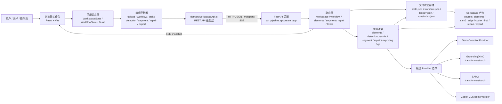
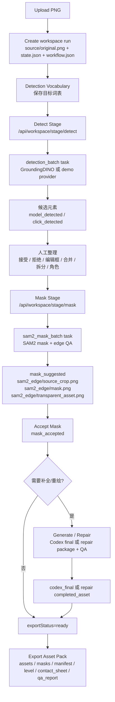
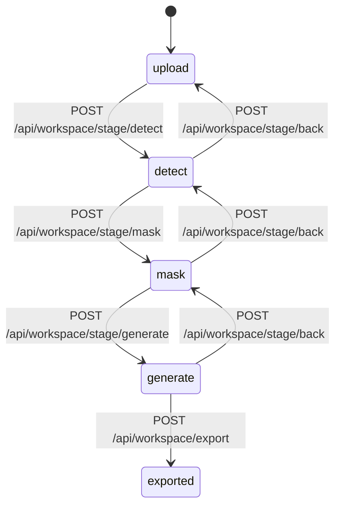
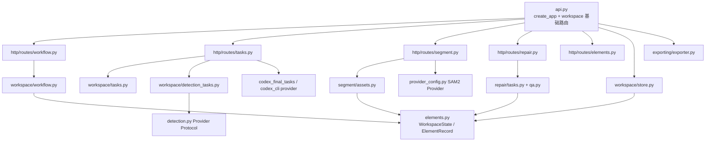
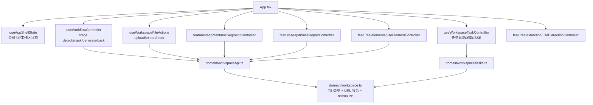
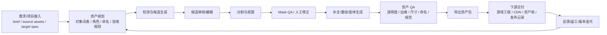

# Art Pipeline V2 Demo 架构图与技术栈分析

面向后续给 ChatGPT 继续分析、设计和扩展使用。

## 1. 当前结论

这个项目当前是一个本地 Web Workbench，核心能力是“单张场景 PNG -> 可审核的候选元素 -> SAM2 边缘分割 -> Codex/修复生成 -> 严格导出贴纸资产包”。它已经有上传、检测、点击检测、分割、修复、任务进度、导出、run/checkpoint 等能力，但还不是完整的项目上下游流水线。

当前最强的工程边界是：

- 前端：React + TypeScript 的工作台 UI，围绕 `WorkspaceState`、`WorkflowState` 和任务状态驱动交互。
- 后端：FastAPI API，文件系统持久化 `workspace/` 下的 JSON 与 PNG 产物。
- 模型能力：通过 provider 边界接入 GroundingDINO、SAM2、Codex CLI/demo provider。
- 编排：轻量 workflow stage + JSON task + 后台线程 + SSE 通知。
- 导出：保守导出，只允许通过 QA/验收的资产进入最终 asset pack。

当前主要缺口是：没有完整的项目/批次/需求 brief/人工审核/发布/回传游戏工程/权限/持久任务队列/数据库/对象存储/跨流程依赖治理。

## 2. 代码依据

本分析基于以下本地源码与配置：

- 根脚本与运行入口：`package.json`、`scripts/setup.mjs`、`scripts/dev.mjs`、`scripts/lib/command-plans.mjs`
- 前端入口：`frontend/src/App.tsx`
- 前端状态与 API 契约：`frontend/src/domain/workspace.ts`、`frontend/src/domain/workspaceApi.ts`、`frontend/src/domain/workspaceTasks.ts`
- 前端主控制器：`frontend/src/app/useWorkflowController.ts`、`frontend/src/app/useWorkspaceTaskController.ts`、`frontend/src/app/useWorkspaceFileActions.ts`
- 后端入口：`backend/art_pipeline/api.py`
- 后端 workflow：`backend/art_pipeline/http/routes/workflow.py`、`backend/art_pipeline/workspace/workflow.py`
- 后端任务：`backend/art_pipeline/http/routes/tasks.py`、`backend/art_pipeline/workspace/tasks.py`、`backend/art_pipeline/workspace/detection_tasks.py`
- 后端状态存储：`backend/art_pipeline/workspace/store.py`
- 后端领域模型：`backend/art_pipeline/elements.py`
- 分割/导出：`backend/art_pipeline/segment/assets.py`、`backend/art_pipeline/exporting/exporter.py`
- Provider 配置：`backend/art_pipeline/provider_config.py`
- 依赖：`backend/pyproject.toml`、`frontend/package.json`、`frontend/vite.config.ts`

## 3. 总体架构图



## 4. 当前业务链路图



## 5. Workflow 状态机

当前 stage 很轻，只有四个主阶段：



注意：

- `workflow.json` 只持久化 stage、generate selection、prompt hints、task ids、last export summary。
- `stage_snapshots/*.json` 用于 stage back 恢复。
- `state.json` 仍是资产状态的主事实源。
- 前端 `workspaceApi.ts` 对 stage API 还有 legacy fallback：`/detect`、`/tasks/sam2-masks`、`/tasks/codex-finals`。

## 6. 后端分层



后端核心特点：

- `WorkspaceState` 和 `ElementRecord` 使用 Pydantic 建模。
- 写状态采用临时文件 + `os.replace`，并带有线程锁，适合本地单机 demo。
- `runId` 支持多处理记录，`workspace/runs/index.json` 作为 run 索引。
- 任务是 `workspace/tasks/task_*.json` 文件，不是外部队列。
- 长任务通过后台线程运行，前端通过 `/api/workspace/tasks/events` SSE 收 task snapshot。

## 7. 前端分层



前端核心特点：

- UI 没有引入全局状态库，使用 React hooks 和顶层 `App.tsx` 组合控制器。
- `domain/workspace.ts` 是前端资产状态类型和 URL 投影的权威入口。
- `domain/workspaceApi.ts` 封装后端 REST API，并做 legacy fallback 与响应 normalize。
- `useWorkspaceTaskController` 负责 SSE、任务列表、任务启动、Codex stop/retry。
- Feature 目录按 detection、segment、repair、generate、export、inspector 等拆分。

## 8. 文件与产物结构

典型 workspace 结构：

```text
workspace/
  runs/
    index.json
    run_<timestamp>_<slug>/
      source/original.png
      state.json
      workflow.json
      stage_snapshots/
        upload.json
        detect.json
        mask.json
      tasks/
        task_<timestamp>_detection-batch.json
        task_<timestamp>_sam2-mask-batch.json
        task_<timestamp>_codex-final-batch.json
      elements/
        element_001/
          thumbnail.png
          sam2_edge/
            source_crop.png
            mask.png
            transparent_asset.png
            segmentation.json
          codex_final/
            source_crop.png
            transparent_asset.png
            ...
          repair/
            source_crop.png
            scene_context.png
            incomplete_asset.png
            preserve_mask.png
            missing_mask.png
            guide_overlay.png
            repair_prompt.md
            completed_asset.png
            repair_report.json
      export/
        assets/
        masks/
        manifest.json
        level.json
        contact_sheet.png
        qa_report.json
```

## 9. 技术栈分析

### 9.1 根工程与脚本

| 层 | 当前选择 | 作用 |
|---|---|---|
| 包入口 | root `package.json` | 统一 `setup`、`dev`、`dev:demo`、脚本测试 |
| 脚本运行时 | Node ESM `.mjs` | 跨平台启动 Python 后端和 Vite 前端 |
| 安装脚本 | `scripts/setup.mjs` | 后端安装、前端安装、模型下载串联 |
| 开发脚本 | `scripts/dev.mjs` | 同时启动 Uvicorn 和 Vite，注入 provider/env/proxy |

优点：

- 脚本使用 Node API，基本符合 Windows/macOS 双端要求。
- `createDevPlan` 通过 env 控制 backend/frontend port 和 provider。
- Windows 停进程使用 `taskkill`，非 Windows 使用 process group。

注意：

- `frontend/vite.config.ts` 默认 proxy 是 `http://127.0.0.1:8000`，但根 `dev` 脚本注入的是 `8766`。如果单独在 `frontend` 下运行 `npm run dev`，需要显式设置 `ART_PIPELINE_API_PROXY` 或单独启动 8000 后端。

### 9.2 后端

| 类别 | 当前选择 | 说明 |
|---|---|---|
| Python | `>=3.11` | 后端运行版本要求 |
| Web 框架 | FastAPI | REST API、上传、SSE StreamingResponse |
| ASGI 服务器 | Uvicorn | 本地开发服务 |
| 数据建模 | Pydantic | `WorkspaceState`、`ElementRecord`、task/workflow/export request |
| 图像处理 | Pillow、NumPy、scikit-image | PNG、mask、alpha、QA、contact sheet 等 |
| 并发/文件安全 | threading、file locks、temp file + `os.replace` | 本地 JSON 状态安全写入 |
| 测试 | pytest、httpx | 后端 API 和领域逻辑测试 |
| 模型依赖 | torch、torchvision、transformers、accelerate、safetensors | optional `[model]`，用于 GroundingDINO/SAM2 |

后端适合当前 demo 的原因：

- 单机本地文件 workspace 易调试，方便直接检查 PNG/JSON 产物。
- Pydantic + FastAPI 对 API 边界足够清晰。
- Provider factory 让 demo/真实模型/测试注入隔离良好。

后端扩展风险：

- 文件系统 JSON 不适合多用户、多机器、长周期生产任务。
- 后台线程 + JSON task 不具备跨进程恢复、分布式调度、强幂等。
- `state.json` 承担太多：资产图、状态机进度、部分业务准入事实都投影到元素字段。
- 新 stage API 与 legacy direct API 并存，扩展流程时容易出现两个事实入口。

### 9.3 前端

| 类别 | 当前选择 | 说明 |
|---|---|---|
| UI 框架 | React 18 | Hooks 组合工作台控制器 |
| 语言 | TypeScript strict | 前端领域类型和 API 响应类型 |
| 构建 | Vite 5 | 本地开发、构建、proxy |
| 测试 | Vitest + jsdom + Testing Library | 前端流程/组件测试 |
| UI 组件 | Radix AlertDialog/Toast/Tooltip | 无障碍基础控件 |
| 图标 | lucide-react | 图标按钮 |
| 交互 | @dnd-kit/core、react-resizable-panels、react-arborist、Tagify | 拖拽、面板、树、词表标签 |

前端适合当前 demo 的原因：

- 不引入 Redux/Zustand，状态规模仍能通过顶层 hooks 管住。
- API 适配层集中，响应 normalize 与 URL 拼接没有散在组件里。
- Feature 目录已经按业务能力拆分。

前端扩展风险：

- `App.tsx` 组合了大量控制器，未来上游/下游流程增多后会变成编排中心。
- 任务、workflow、workspace 三套状态在前端同时存在，需要明确谁是 UI 主事实源。
- legacy fallback 逻辑如果长期保留，会让新增流程必须兼容旧后端语义。

### 9.4 模型与资产生成

| 能力 | 当前边界 | 说明 |
|---|---|---|
| 检测 | `DetectionProvider.detect(image, vocabulary, prompt)` | demo 或 GroundingDINO |
| 点击检测/分割 | `Sam2ClickProvider.detect(image, prompt)` | SAM2 生成 mask |
| 最终重绘 | `CodexAssetProvider` / `CodexCliAssetProvider` | 通过 Codex CLI 生成 final asset |
| QA | `segment/quality.py`、`qa.py`、export preflight | 分割质量、修复质量、导出准入 |

模型边界设计方向是正确的：检测、分割、最终重绘分别隔离，避免把一个模型当成万能 pipeline。但未来要完整上下游，需要把“模型执行任务”与“业务流程任务”分开建模。

## 10. 当前覆盖范围 vs 缺失上下游

当前覆盖：

- 上传单张 PNG。
- 管理 detection vocabulary。
- 检测候选框、点击生成候选。
- 人工编辑候选、合并、拆分、角色标记。
- SAM2 mask 建议、手工 patch、mask accept。
- Codex final/repair 包准备、repair QA。
- 严格导出 asset pack。
- 多 run/checkpoint、任务进度、SSE 刷新。

缺失或较弱：

- 项目级实体：项目、批次、需求 brief、目标平台、风格规范、版本号。
- 上游资产接入：多图输入、PSD/分层图、设计稿、标注文件、外部素材库。
- 流程编排：可配置 pipeline、阶段依赖、重试策略、人工审批节点、跨 run 依赖。
- 持久化：数据库索引、对象存储、历史版本、资产 lineage。
- 多用户：权限、审计、评论、分配任务。
- 生产任务：持久队列、worker 池、失败恢复、取消/暂停/继续、资源调度。
- 下游交付：游戏工程导入、命名规范校验、引擎 metadata、发布记录、回滚。
- 可观测性：结构化日志、指标、trace、模型成本/耗时统计。

## 11. 后续扩展时的推荐目标架构

不要直接把当前四阶段 workflow 拉长成几十个 if/else。建议先明确三个权威事实源：

| 事实源 | 负责什么 | 当前位置 | 扩展建议 |
|---|---|---|---|
| Asset Graph | 源图、元素、父子关系、角色、产物引用、QA 状态 | `state.json` | 保留语义，但未来迁到 DB 表/文档 |
| Workflow Cursor | 当前流程阶段、可回退快照、阶段选择 | `workflow.json` | 扩成 pipeline run/stage run |
| Execution Records | 每次模型/导出/修复任务执行、进度、失败、artifact | `tasks/*.json` | 迁到持久任务表或外部编排器 |

建议完整链路：



最小新增领域对象：

| 对象 | 字段示例 | 为什么需要 |
|---|---|---|
| `Project` | id、name、owner、targetPlatform、styleGuide | 承接完整上游项目上下文 |
| `SourceAsset` | file、type、checksum、metadata、license | 多输入、多版本、可追溯 |
| `PipelineRun` | projectId、sourceAssetIds、status、startedAt、finishedAt | 一次完整生产流程 |
| `StageRun` | pipelineRunId、stage、status、inputRefs、outputRefs | 每个阶段可重试/回退/审计 |
| `AssetNode` | role、parentId、state、artifactRefs、qaRefs | 当前 `ElementRecord` 的生产化版本 |
| `Artifact` | path/objectKey、kind、sha256、mime、width、height | 产物引用从字符串路径升级为稳定结构 |
| `ReviewTask` | assignee、decision、comments、dueAt | 人工审核进入流程 |
| `DeliveryRecord` | target、manifest、version、publishedAt | 下游交付可追踪 |

## 12. 开源方案选型建议

按项目约束，扩展时应优先采用成熟开源方案，不建议自研通用 workflow engine。

### 12.1 继续本地 demo 的最低成本路线

保留 FastAPI + 文件 workspace + JSON task。

适合：

- 单人/小团队本地验证。
- 继续打磨 UI 和模型链路。
- 不需要多 worker、权限和长期可恢复任务。

要求：

- 先收敛新 stage API 为唯一编排入口。
- legacy fallback 设定删除条件。
- `state.json`、`workflow.json`、`tasks/*.json` 的职责写清楚。

### 12.2 需要生产级长流程

候选方案：

- Temporal：适合长生命周期、可恢复、强状态的业务 workflow。官方 Python SDK 文档提供 Workflow、Activity、Worker 等核心抽象。
- Prefect：适合 Pythonic 数据/媒体处理流程，强调状态、重试、监控、动态运行和事件触发。
- Dagster：适合把资产和数据 lineage 放在中心，官方文档强调 assets、jobs、asset checks、observability。
- Celery：适合分布式任务队列和 worker/broker 模式，但官方文档明确 stable Celery 不支持 Microsoft Windows；本项目有 Windows/macOS 双端要求，若要本地跨平台开发，应谨慎选择。

建议：

- 如果核心诉求是“美术生产流程的长事务、可暂停、可恢复、人工节点”，优先评估 Temporal 或 Prefect。
- 如果核心诉求是“资产 lineage、资产检查、批量生产与回填”，优先评估 Dagster。
- 如果只需要把现有耗时模型调用丢到 worker，不需要完整 workflow 语义，再考虑任务队列；但要避开 Windows 本地开发不支持的方案。

官方资料：

- Temporal Python SDK: https://docs.temporal.io/develop/python
- Prefect 3 introduction: https://docs.prefect.io/v3/get-started/index
- Dagster docs: https://docs.dagster.io/
- Celery introduction: https://docs.celeryq.dev/en/stable/getting-started/introduction.html

## 13. 给 ChatGPT 的上下文提示词

可以把下面这段连同本文档一起给 ChatGPT：

```text
你正在分析一个本地 art pipeline workbench 项目。当前项目用 React + TypeScript + Vite 做前端，FastAPI + Pydantic + Pillow/NumPy/scikit-image 做后端，workspace 文件系统下保存 state.json、workflow.json、tasks/*.json 和 PNG/JSON 产物。当前链路是单图上传 -> detection vocabulary -> GroundingDINO/demo 检测或 SAM2 click detect -> 候选元素审核/编辑/合并/拆分 -> SAM2 mask/edge QA -> Codex final 或 repair QA -> 严格导出贴纸 asset pack。

现有 WorkflowStage 只有 upload/detect/mask/generate。任务系统是 JSON 文件 + 后台线程 + SSE，不是外部队列。state.json 是资产图主事实源，workflow.json 是阶段光标，tasks/*.json 是执行记录。项目还不是完整上下游流水线，缺项目/批次/brief/多输入/人工审批/发布/回传/权限/数据库/对象存储/生产级编排。

请在扩展设计时遵守：优先成熟开源方案，避免自研 workflow engine；不要新增空泛 manager/registry 层；每个新增抽象必须隔离真实外部协议、生命周期、副作用或有多个真实调用方；Windows/macOS 脚本必须跨平台；测试放在各 package 的 tests/ 下。
```

## 14. 下一步建议

1. 先决定扩展目标是“继续本地 demo”还是“生产级上下游系统”。两者架构差异很大。
2. 收敛编排入口：将 `/api/workspace/stage/*` 设为主路径，给 legacy fallback 定义删除条件。
3. 设计 `PipelineRun` / `StageRun` / `Artifact` 最小模型，不急着引入完整数据库前先用 Pydantic schema 验证。
4. 把“模型执行任务”和“业务流程阶段”拆开：模型任务可以失败重试，业务阶段需要审批、回退和产物选择。
5. 如果需要多人/多机/长期运行，再评估 Temporal/Prefect/Dagster，而不是继续扩展 JSON task。
