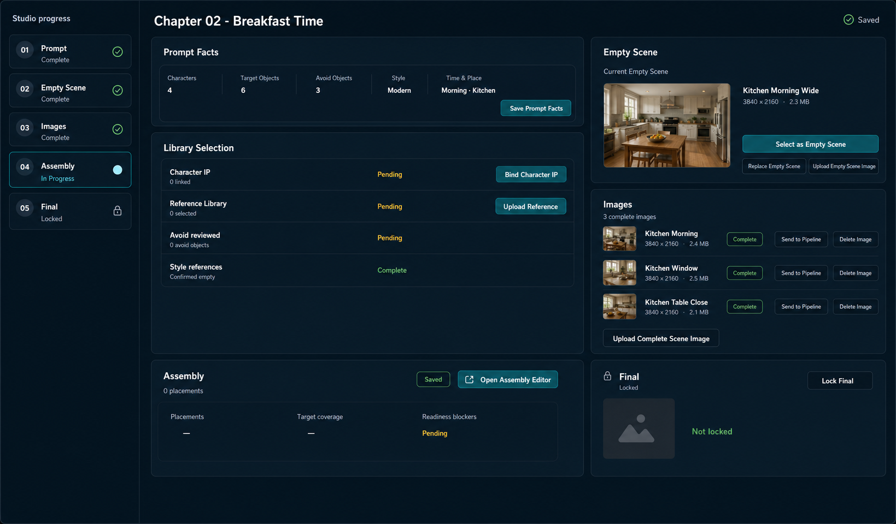
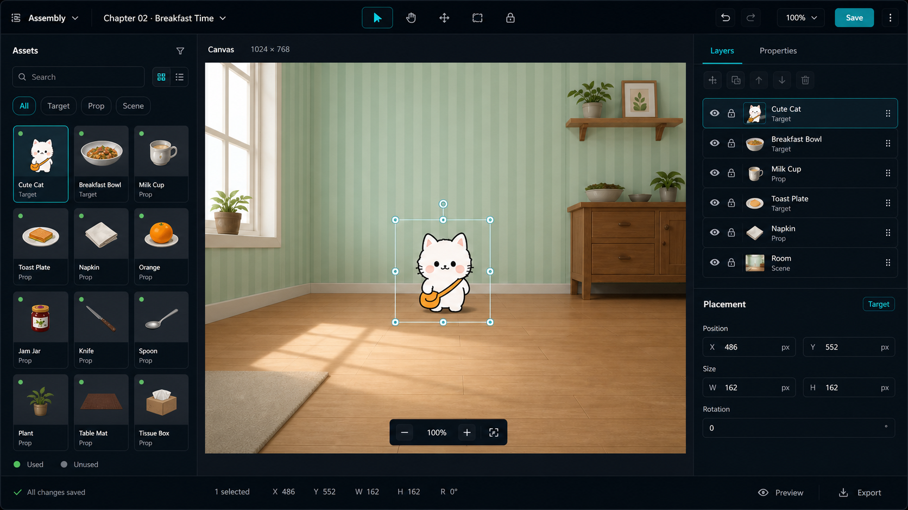

# Placement Editor Redesign Implementation Plan

> **For agentic workers:** REQUIRED SUB-SKILL: use `superpowers:subagent-driven-development` or `superpowers:executing-plans` when executing this plan.

**Goal:** Separate Chapter preparation from Assembly placement editing, then rebuild Assembly as a full editor surface.

**Architecture:** Chapter and Assembly are two different workspaces. `ChapterWorkspacePage` is a chapter preparation and status page with cards, drawers, and an `Open Assembly Editor` entry point. The Assembly editor route owns the full placement editor: left assets, center canvas, right layers/properties. Existing assembly manifest, autosave, conflict, alignment-risk, and lock-final logic remains the source of truth.

**Tech Stack:** React 18, TypeScript, React Router, tldraw `hideUi`, react-arborist, lucide-react, existing Course Planner API/hooks, Vitest, Testing Library.

---

## Correct Relationship

- **Chapter page:** prompt facts, library/characters, empty scene, generated images, assembly readiness summary, final status.
- **Assembly editor:** asset pool, canvas placement, layers, placement properties, target coverage, save/autosave.
- **Connection:** Chapter links to Assembly editor with `Open Assembly Editor`; Assembly editor links back to Chapter.
- **Hard rule:** Chapter page must not render `AssemblyWorkspacePanel`, a large canvas, `Assembly layers`, or `Placement properties`.

## Source-Of-Truth UI Contract

Do not implement buttons or areas just because they appear in an imagegen mockup. The mockups are layout references only. The source of truth is the existing domain model and components.

### Chapter Page Allowed Areas

- `Studio progress`
- `Prompt facts`
- `Library selection`
- `Empty scene images`
- `Complete scene images`
- `Assembly summary`
- `Final scene`

### Chapter Page Allowed Actions

- `Save Prompt Facts`
- `Bind Character IP`
- `Upload Reference`
- `Select` reference image
- `Upload Empty Scene Image`
- `Select as Empty Scene`
- `Replace Empty Scene`
- `Upload Complete Scene Image`
- `Send to Pipeline`
- `Delete Image`
- `Open Assembly Editor`
- `Lock Final`

### Assembly Editor Allowed Areas

- `Assembly workspace`
- `Assembly asset pool`
- `Assembly canvas`
- `Assembly layers`
- `Placement properties`
- `Target coverage`
- Assembly readiness/save feedback from `AssemblyWorkspaceFeedback`

### Assembly Editor Allowed Actions

- `Back to Chapter`
- `Upload Scene Asset`
- `Upload target object`
- `Add to Assembly`
- `Locate Placement`
- `Duplicate Chapter Asset`
- `Delete Asset`
- `Save Assembly` / `Retry`
- `Clear placements`
- `Undo`
- `Redo`
- `Fit`
- `Zoom in`
- `Zoom out`
- `Group selected layers`
- `Ungroup selected layer`
- `Target`
- `Initial`
- `Remove placement`
- existing confirmation actions

### Explicitly Disallowed Without Separate Product Approval

- `Save Chapter`
- `Preview`
- `Export`
- new run controls
- new asset categories not represented in `ChapterScenePackage`
- gameplay step, tolerance, target area, or custom metadata editors
- layer/canvas controls not backed by current tldraw, layer tree, or manifest-draft behavior

## Reference Artifacts

- Correct Chapter reference: `D:\work\art-pipeline-v2-demo\output\design\chapter-page-separated-assembly-reference-imagegen.png`
- Correct Assembly reference: `D:\work\art-pipeline-v2-demo\output\design\placement-editor-reference-imagegen.png`
- Rejected Chapter reference: `D:\work\art-pipeline-v2-demo\output\design\rejected-chapter-workspace-embedded-assembly-imagegen.png`

### Accepted Chapter Reference

### Accepted Assembly Editor Reference

## Visual Restoration Gate

These two accepted reference images are mandatory visual targets. Do not mark implementation complete until both surfaces are restored against the references in a real browser.

- Chapter page must match the accepted Chapter reference in layout, card hierarchy, density, and separation from the Assembly editor.
- Assembly editor page must match the accepted Assembly reference in left asset pool, center canvas, right layers/properties, top controls, and bottom status structure.
- Tests and TypeScript build are necessary but not sufficient.
- If a browser screenshot still materially differs from the accepted references, continue CSS/component iteration instead of handing off.
- Dynamic data values may differ: exact thumbnails, counts, status values, titles, and filenames can reflect the loaded fixture/package.

## Old Patch Disposition

- **Delete/rewrite:** Any layout that makes Chapter the host for the full Assembly editor.
- **Delete/rewrite:** `ChapterSceneStudio` rendering `AssemblyWorkspacePanel` inline.
- **Keep:** `AssemblyWorkspacePanel` draft/autosave/conflict/alignment-risk/lock-final state.
- **Keep:** `AssemblyEditorCanvas` tldraw adapter and snapshot projection.
- **Keep:** `AssemblyLayerTree` group/reorder behavior.
- **Keep:** `AssemblyPlacementProperties` runtime role, transform, dependency, and removal logic.
- **Rewrite visually:** Assembly asset pool density, canvas toolbar, layers/properties layout, and Chapter cards.

## Implementation Tasks

- [ ] Add route-level tests proving Chapter has only the Assembly summary and the Assembly route owns editor landmarks.
- [ ] Extract shared scene-package loading/mutation logic into `useChapterScenePackageWorkspace`.
- [ ] Convert `ChapterSceneStudio` into a Chapter overview with Prompt, Library, Empty Scene, Images, Assembly summary, and Final cards.
- [ ] Add `/course-planner/chapters/:chapterId/assembly` and render only the Assembly editor on that route.
- [ ] Rebuild Assembly as a product editor shell: left asset pool, center tldraw canvas, right layers/properties, bottom statusbar.
- [ ] Compact the asset pool into icon-first cards with accessible action labels and no visible UUID noise.
- [ ] Keep canvas/layer/property behavior backed by existing tldraw, layer tree, and manifest-draft code.
- [ ] Verify with Course Planner tests, frontend build, and 1920 x 1080 browser screenshots for both routes.

## Acceptance Checklist

- [ ] Chapter route has no large editable canvas, `Assembly layers`, or `Placement properties`.
- [ ] Chapter route has one clear `Open Assembly Editor` entry in the Assembly summary card.
- [ ] Assembly route uses the three-column editor composition from the accepted reference.
- [ ] Asset pool remains usable with many resources through compact cards, filters, and search.
- [ ] Save/autosave/add/locate/group/property/delete/upload flows still pass tests.
- [ ] Browser screenshots are saved under `D:\work\art-pipeline-v2-demo\output\verification`.
- [ ] Current screenshots are compared to the two accepted reference images before completion is claimed.

## Sources

- Figma editor area model: https://help.figma.com/hc/en-us/articles/15297425105303-Explore-design-files
- Figma right-sidebar properties model: https://help.figma.com/hc/en-us/articles/360039832014-Design-prototype-and-explore-layer-properties-in-the-right-sidebar
- tldraw custom UI and `hideUi`: https://tldraw.dev/examples/custom-ui and https://tldraw.dev/examples/hide-ui
- react-arborist tree and drag model: https://github.com/jameskerr/react-arborist
