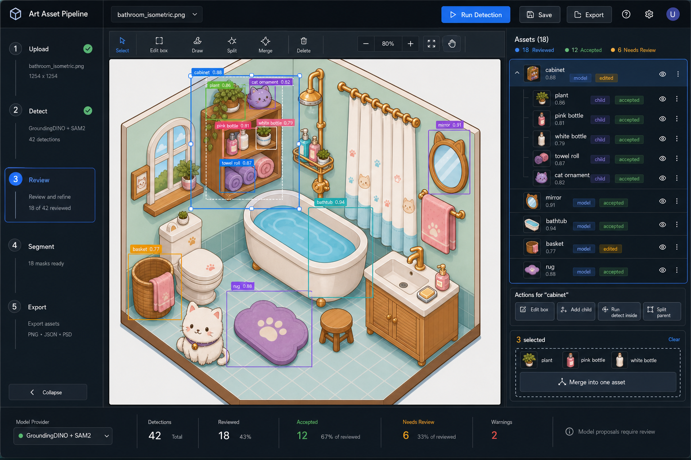

# 基于真实模型的资产拆分管线重构设计

日期：2026-06-17

参考原型图：



原型图已保存到项目内：`docs/assets/model-backed-pipeline-ui-v1.png`

## 设计目标

把当前 demo 式 workbench 重构成一个真正能跑资产拆分流程的工具。第一版必须完成这条闭环：

```text
上传图片
-> 运行真实模型检测
-> 人工审核和修正候选框
-> 对大物体拆子物体
-> 对过细小框做合并
-> 对已确认资产生成 mask
-> 导出已审核资产包
```

这次重构的底线是：**不能再用同色连通域、边缘连通域、或者任何弱启发式结果冒充智能识别。** 模型没有配置、模型失败、或者没有检测结果时，系统必须明确失败或显示空结果，不能生成假候选。

## 需求对照检查

| 你的要求 | 设计里如何满足 | 是否覆盖 |
| --- | --- | --- |
| 页面必须像流水线，不是一堆按钮 | 左侧固定流程：上传、检测、审核、分割、导出；当前步骤高亮；主操作随步骤变化 | 已覆盖 |
| 检测要用真实模型，不要玩具 fallback | 检测改成 provider 架构，目标是 GroundingDINO 类开放词汇检测；启发式 fallback 禁用 | 已覆盖 |
| 检测框不准时要能手动改 | 选中候选后进入框编辑：拖动、缩放、键盘微调、重置到模型框 | 已覆盖 |
| 大物体里要能拆小物体 | 父候选支持 Add child、Split parent、Run detect inside；子物体挂到父节点下 | 已覆盖 |
| 检测拆太细时要能合并 | 多选候选后出现 Merge into one asset；生成新候选，旧框进入历史 | 已覆盖 |
| 操作必须知道当前能点什么 | 无选择、单选、多选、编辑中分别显示不同动作，不再全局堆按钮 | 已覆盖 |
| 需要随时参考设计图 | 原型图已保存到 `docs/assets/model-backed-pipeline-ui-v1.png`，实现时以这张图为准 | 已覆盖 |
| 测试不能再自嗨 | 测试目标改成用户价值：模型失败、过滤、编辑、拆分、合并、导出规则 | 已覆盖 |

我的自检结论：这份设计覆盖了你现在最在意的核心问题。它还没有细化模型部署方式、SAM2 本地性能、以及最终导出格式字段的全部细节，这些应该进入实现计划阶段再拆，不应该现在混在界面设计里。

## 完整界面结构

主界面保留一个完整工作台，不做局部小工具：

- 顶部栏：项目名、当前图片、运行检测、保存、导出。
- 左侧流程栏：上传、检测、审核、分割、导出。
- 中央画布：图片、候选框、选中框、父子框、多选合并预览、mask 预览。
- 右侧资产树：候选资产、父子关系、状态、当前可执行动作。
- 底部状态条：模型 provider、候选数量、已接受数量、待审核数量、警告。

默认界面只暴露当前阶段最重要的信息。几何字段、provider debug、阈值配置、历史记录都收进二级面板，避免一进来就满屏控件。

## 真实检测管线

检测管线采用 provider 架构：

```text
source image
-> detection provider 输出 label / bbox / confidence / metadata
-> 过滤和去重
-> 用户审核和编辑
-> segmentation provider 基于已审核 bbox 生成 mask
-> 导出 manifest、图片、mask
```

第一版模型目标：

- 检测：GroundingDINO 风格的开放词汇检测器。
- 分割：SAM2 风格的 promptable segmentation，用已审核 bbox 生成 mask。

初始资产词表：

```text
cat, bathtub, sink, bathroom cabinet, mirror, window, curtain,
towel, basket, stool, bottle, plant, shelf, rug
```

检测结果必须包含：

- `id`
- `label`
- `confidence`
- `bbox`
- `sourceProvider`
- `sourcePrompt`
- `status`
- `parentId`
- `history`

过滤规则：

- 丢弃不在资产词表里的 label。
- 丢弃泛标签：`bathroom`、`room`、`wall`、`floor`、`object`、`furniture`、`background`。
- 丢弃未配置的组合标签，比如 `basket stool`。
- 按 label 分组配置置信度阈值。
- 使用 NMS 去掉重复框。

## 候选状态

候选状态描述工作流，不暴露实现细节：

- `model_detected`：模型原始候选经过过滤后的结果。
- `edited`：用户改过 label 或 bbox。
- `child`：父对象下面的子资产。
- `merged`：多个小框合并生成的新候选。
- `accepted`：用户确认可进入分割和导出。
- `rejected`：用户拒绝，默认隐藏但可恢复。
- `exported`：已经进入当前导出 manifest。

拒绝、合并掉、或者被替换的候选默认不物理删除。它们进入历史记录，用户可以恢复。

## 手动编辑检测框

检测框不准时，用户可以直接编辑：

- 拖动整个框移动位置。
- 拖动四角和四边 handle 改大小。
- 方向键微调 1px。
- Shift + 方向键微调 10px。
- Reset to model box 恢复模型原始框。

一旦用户编辑，候选状态变成 `edited`，并在 `history` 里记录旧 bbox、旧 label、修改时间。

右侧默认只显示：

- label
- confidence
- status
- parent 关系
- 当前主操作

原始 bbox 数字字段放进 Advanced，不默认展开。

## 大物体拆成子物体

典型场景：模型检测到了整个 `cabinet`，但用户想拆里面的 `plant`、`bottle`、`towel roll`、`cat ornament`。

资产树表示为：

```text
cabinet
  plant
  pink bottle
  white bottle
  towel roll
  cat ornament
```

交互：

1. 用户选中父候选，比如 `cabinet`。
2. 右侧显示 `Add child`、`Split parent`、`Run detect inside`。
3. 中央画布聚焦到父框区域，父框外的内容弱化。
4. 用户可以手动画子框，也可以只在父框区域内重新跑检测。
5. 新子候选写入 `parentId`。
6. 父候选保留为 container，不直接丢弃。

默认导出规则：

- 子候选可以接受并导出。
- 如果父候选下面已有已接受子候选，父候选默认不导出。
- 用户可以显式标记父候选也导出。

这个规则避免“大框拆小框后，大框消失导致无法追溯”。

## 过细小框合并

典型场景：模型把一个物体拆成几个小框，用户希望合成一个资产。

交互：

1. 用户 Shift 多选、勾选、或套索选择多个候选。
2. 右侧切到多选操作条。
3. 用户点击 `Merge into one asset`。
4. 画布显示合并预览框，默认是选中框的外接矩形。
5. 用户确认或修改合并后的 label。
6. 系统创建一个新候选，状态为 `merged`。
7. 原来的小框标记为 merged history，默认从审核列表隐藏。

后续分割基于合并后的 bbox 重新跑 SAM2，不能简单拼接旧 mask。

## 资产树

右侧面板采用资产树，而不是平铺卡片列表。

资产树能力：

- parent 可以展开和折叠。
- child 缩进显示。
- 每行显示 label、confidence、状态 chip。
- 点击树节点，高亮画布框。
- 点击画布框，同步选中树节点。
- rejected 和 merged-away 候选默认隐藏，但可以从历史恢复。

资产树解决两个关键问题：

- 用户能理解大物体和子物体关系。
- 用户能理解合并和拆分的历史，不会丢结果。

## 画布行为

画布是主工作区，必须支持：

- pan / zoom。
- bbox overlay。
- selected box handles。
- parent / child 视觉区分。
- 多选状态。
- merge preview。
- segmentation 后的 mask overlay。

默认视图不显示所有 debug overlay。优先显示：

- 当前选中候选。
- accepted 候选。
- needs review 候选。
- 当前编辑或合并预览。

## 导出规则

默认导出只包含审核过的资产：

- accepted standalone candidate。
- accepted child candidate。
- accepted merged candidate。
- 用户显式选择导出的 parent candidate。

导出内容：

- asset manifest
- source image metadata
- label
- status
- bbox
- parent relationship
- provider metadata
- mask path

默认 asset-pack 导出要求 accepted asset 已有 mask。没有 mask 的 accepted asset 阻塞导出。可以以后加 bbox-only debug export，但必须明确标成 debug，不能作为默认导出路径。

## 错误和空状态

关键失败必须明确：

- 没有配置 provider：提示模型未配置。
- provider 失败：提示模型错误，保留已有审核状态。
- 没有检测结果：显示空结果，并提示调整词表或阈值。
- segmentation 失败：保留 bbox，标记 mask missing。

系统禁止静默 fallback 到同色连通域、边缘连通域、或者其它会制造假候选的启发式算法。

## 测试策略

测试必须验证用户价值，不再验证“能吐出一些框”。

必须覆盖：

- 没配置 detection provider 时，检测明确失败。
- provider 输出能规范化成 label、confidence、bbox、metadata、status。
- 泛标签和词表外 label 会被过滤。
- 重复框会被 NMS 去重。
- 编辑 bbox 会改 geometry，记录 history，并把状态改成 `edited`。
- split parent 会创建 child，并保留 parent。
- merge 会创建新候选，并隐藏原候选到 history。
- export 只包含 accepted standalone、child、merged，以及显式选择导出的 parent。
- UI 在无选择、单选、多选、编辑中分别只显示相关动作。

fixture 测试必须针对代表性场景检查有意义的对象和关系，不能只断言 “proposals 数量大于 0”。

## V1 不做的事

这些先不进入 V1，避免核心管线再次失焦：

- Codex repair task。
- inpainting / completion。
- 大型 QA dashboard。
- 把自由画 mask brush 当主路径。
- 多场景项目管理。
- provider marketplace / provider UI。

等上传、检测、审核、编辑、拆分、合并、分割、导出这条主线稳定后，再扩展这些能力。
