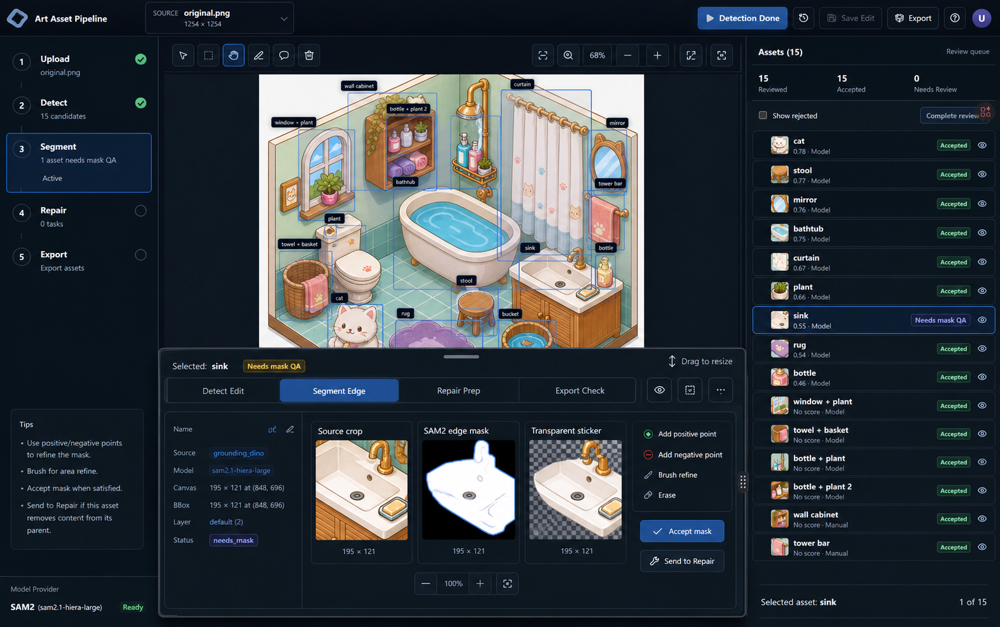

# 贴纸游戏资产拆分管线设计

日期：2026-06-18

参考界面图：



参考图已保存到项目内：`docs/assets/sam2-panel.png`

## 设计目标

把当前 workbench 从“检测框 + 矩形裁切 demo”升级为贴纸游戏资产生产工具。最终产物不是一张完整场景图，也不是带背景的矩形 crop，而是一组可以在游戏里独立摆放的完整物体贴纸：

- 每个物体有贴边透明 PNG。
- 每个物体有精细 alpha mask。
- 每个物体保留原图位置、bbox、canvas、层级和父子关系。
- 被前景子物体摘除后的父物体，需要经过重绘修复后导出完整版本。
- 原本被遮挡但需要作为独立贴纸的物体，也需要通过修复补全被遮挡部分。

第一版必须明确区分三个模型职责：

```text
Grounding DINO：按用户词表找候选物体框
SAM2：按 bbox / 点击点 / 正负点生成和修正边缘 mask
Codex：只在修复阶段编排重绘任务、接回结果和做 QA
```

## 需求对照检查

| 需求 | 设计响应 |
| --- | --- |
| 上传后词表不能写死 | Upload 后显示 Detection Vocabulary 输入区，默认填内置词表，用户可追加 bucket / basin 等词 |
| 水桶这类漏检物体要能补 | Detect 阶段加入 Click Detect，用户点击图中物体后局部识别并创建候选 |
| Detect 仍然允许人工编辑 | Detect 阶段保留手画框、拖拽调整、拆分、合并、重命名、接受/拒绝 |
| 抠图不应该在 Detect 做 | Segment 阶段才做边缘检测、SAM2 mask、remove background 和 mask QA |
| 抠图需要人工介入 | 中央画布前方增加可拖动高度的浮动编辑板，提供正负点、笔刷、橡皮和 mask 预览 |
| 修复不要用本地 LaMa | Repair 阶段由 Codex 编排图像重绘 provider，不采用本地 LaMa 作为默认路线 |
| 父物体要完整 | 子物体被摘除后，父物体用 removal mask 生成修复任务，导出补全后的完整物体 |
| 暂不做复杂内部遮挡 | 柜子下层毛巾这类需要层内遮挡建模的物体，第一版先作为父物体的一部分保留 |

## 完整流程

主流程调整为：

```text
Upload
-> Detect
-> Segment
-> Repair
-> Export
```

旧流程里的 Review 不再作为独立大阶段。审核行为仍然存在，但归入 Detect 和 Segment：

- Detect QA：候选框、命名、父子关系、拆分合并是否正确。
- Segment QA：边缘 mask、透明 PNG、物体完整性是否正确。
- Repair QA：重绘是否只改允许区域，父物体或被遮挡物体是否补全。

左侧流程栏只显示五个阶段。任何时刻只允许一个阶段 active，后续阶段可以显示 blocked / ready / done 状态，但不能同时 active。

## Upload 与词表设置

Upload 成功后，中央区域顶部显示 Detection Vocabulary 输入区。它服务于 Grounding DINO 的文本提示，不是普通备注。

默认词表来自后端配置，第一版可包含：

```text
cat, bathtub, toilet, sink, bathroom cabinet, mirror, window, curtain,
towel, basket, stool, bottle, plant, shelf, rug, bucket, basin
```

用户可以：

- 增加本次图片特有词，例如 `water bucket`、`soap dish`、`trash bin`。
- 删除不相关词，减少误检。
- 保存为项目默认词表。
- 将本次 detect run 使用过的词表写入 workspace state，便于追溯漏检原因。

Grounding DINO provider 只对这份词表做开放词汇检测。若词表中没有 `bucket`，水桶漏检是可预期结果，不能归因给 Segment 或 Export。

## Detect 阶段

Detect 阶段负责产生和整理候选物体，不负责最终抠图。

### 自动检测

用户点击 Run Detection 后：

```text
source image
-> vocabulary prompt
-> Grounding DINO provider
-> bbox / label / confidence / sourcePrompt
-> 过滤、NMS、归一化
-> 候选资产列表
```

过滤规则仍然保守：

- 丢弃泛标签：`bathroom`、`room`、`wall`、`floor`、`object`、`background`。
- 丢弃退化 bbox。
- 按 label 和置信度做过滤。
- 按 label 分组做 NMS，避免重复框。

### 点击补检

当自动检测漏掉水桶这类物体时，用户留在 Detect 阶段，选择 Click Detect：

1. 用户在画布上点击漏检物体。
2. 系统以点击点周围生成局部 ROI。
3. 优先使用 SAM2 point prompt 生成局部 mask。
4. 从 mask 反推出 bbox。
5. 如果用户同时输入 label，则创建该 label 的候选；否则创建 `untitled` 候选等待命名。

点击补检仍然属于 Detect，因为它产出的是候选物体和 bbox，不是最终贴纸。

### 人工编辑

Detect 阶段必须支持：

- 拖动 bbox。
- 调整四边和四角。
- 手动画新 bbox。
- 重命名 label。
- 拆分父框。
- 合并多个小框。
- 标记候选为 accepted / rejected。
- 设置候选角色：独立贴纸、父物体、嵌入物、不导出。

第一版角色定义：

| role | 含义 |
| --- | --- |
| `sticker` | 独立贴纸，进入 Segment |
| `parent` | 父物体，可能被子物体摘除后修复 |
| `removable_child` | 可独立导出，并需要从父物体中移除 |
| `embedded_keep` | 保留在父物体内，不单独导出 |
| `skip` | 不导出 |

例如：

- 猫：`sticker`
- 水桶：`sticker`
- 柜子：`parent`
- 柜子上层瓶子和植物：`removable_child`
- 柜子下层毛巾：第一版标记为 `embedded_keep`

## Segment 阶段

Segment 阶段负责从已确认候选生成贴边 mask 和透明贴纸。

当前 `bbox_alpha` 只能作为 debug fallback，不能作为合格产物。合格产物必须经过 edge mask QA。

### 可拖动浮动编辑板

参考图 `docs/assets/sam2-panel.png` 中的中间底部区域作为实现依据：

- 面板浮在主画布前方，而不是普通文档流底部区域。
- 面板顶部有拖拽把手，可调整高度。
- 面板遮挡画布底部时，画布仍保持当前缩放和选中态。
- 面板内容随阶段切换，但保持同一空间，避免多个侧栏抢占画布。

Segment 面板包含：

- 当前选中资产名称和状态。
- `Source crop`：审计用原始裁片。
- `SAM2 edge mask`：当前精细 mask 预览。
- `Transparent sticker`：应用 mask 后的透明 PNG 预览。
- 正点 / 负点工具。
- Brush refine / Erase 工具。
- Accept mask。
- Send to Repair。

### SAM2 mask 生成

Segment 的默认生成路径：

```text
accepted bbox
-> SAM2 box prompt
-> initial mask
-> mask clean up
-> transparent sticker preview
-> human QA
-> accepted mask
```

人介入方式：

- 点正点：告诉模型“这里属于物体”。
- 点负点：告诉模型“这里不是物体”。
- 局部 brush：补模型漏掉的边缘。
- Erase：去掉误包含背景。
- Reset：回到上一次模型 mask。

mask 保存后，透明贴纸必须只包含物体本体。例如猫 asset 不应包含地砖、墙角或旁边 rug。

## Repair 阶段

Repair 阶段只处理“完整物体”问题，不处理基础边缘抠图。

本项目不采用 LaMa 作为默认修复路线。Codex 在这里的职责是编排修复重绘，而不是替代 SAM2 做边缘识别。

### 修复类型

第一版支持两类修复：

1. 子物体摘除后的父物体补全  
   例如 `bottle + plant 2` 从 `wall cabinet` 上独立导出后，`wall cabinet` 本身需要移除这些子物体，并补全柜面。

2. 原本被遮挡区域补全  
   例如马桶被衣篓遮住。如果马桶要作为完整贴纸导出，需要补全被遮挡区域。

第一版不支持复杂内部遮挡贴回：

- 柜子下层毛巾这类嵌入结构先不拆。
- 如果后续要拆，需要额外设计遮挡层、插槽和运行时渲染规则。

### Codex 修复编排

Repair 任务包包含：

```text
source_crop.png
incomplete_asset.png
remove_mask.png
preserve_mask.png
context_crop.png
repair_prompt.md
repair_contract.json
```

Codex 负责：

- 根据父子关系生成 repair mask。
- 生成明确的修复 prompt。
- 调用或交给外部图像重绘 provider。
- 接回 `completed_asset.png` 和 `repair_report.json`。
- 做 QA。

重绘 provider 可以后续替换，第一版接口必须 provider 化。允许的 provider 类型：

- `manual_codex_task`：Codex 生成任务包，人工或外部工具产出结果。
- `image_redraw_api`：后续接入图像重绘 API。
- `local_comfyui`：后续接入本地 ComfyUI 或其它重绘服务。

不允许把 provider 细节写死在 UI 状态里。

### Repair QA

Repair QA 至少检查：

- 输出 PNG 尺寸与输入 asset 一致。
- 输出有 alpha。
- preserve mask 外像素不能被重绘污染。
- remove / missing mask 区域必须有变化。
- repair report 存在并记录 provider、prompt、输入文件、时间和人工验收状态。

## Export 阶段

Export 只导出 QA 通过的贴纸资产包。

导出目录：

```text
workspace/export/
  assets/<asset_id>.png
  masks/<asset_id>.png
  source_crops/<asset_id>.png
  manifest.json
  level.json
  contact_sheet.png
  qa_report.json
```

`manifest.json` 记录：

- `id`
- `name`
- `role`
- `parentId`
- `children`
- `removeFromParent`
- `bbox`
- `canvas`
- `layer`
- `sourceProvider`
- `segmentationProvider`
- `repairProvider`
- `assetPath`
- `maskPath`
- `sourceCropPath`
- `repairStatus`
- `qaStatus`

`level.json` 记录贴纸回放和游戏初始布局所需信息：

- 原始场景尺寸。
- 资产原始中心点。
- z-order。
- 父子关系。
- 是否默认可拖动。
- 是否作为父物体的一部分保留。

默认导出规则：

```text
sticker + accepted mask -> exported
parent + accepted mask + no removed children -> exported
parent + removed children + repair_complete -> exported
removable_child + accepted mask -> exported
embedded_keep -> 不单独导出，保留在父物体中
skip / rejected -> skipped
missing mask -> blocked
repair required but incomplete -> blocked
```

## 状态模型

候选和资产状态拆成两个维度，避免一个字段承担所有语义。

### detectionStatus

- `model_detected`
- `click_detected`
- `manual_box`
- `edited`
- `split_child`
- `merged`
- `accepted`
- `rejected`

### segmentationStatus

- `not_started`
- `mask_suggested`
- `mask_editing`
- `mask_accepted`
- `mask_rejected`

### repairStatus

- `not_required`
- `required`
- `task_created`
- `redraw_pending`
- `repair_complete`
- `qa_failed`

### exportStatus

- `not_ready`
- `ready`
- `exported`
- `blocked`

这些状态分别驱动左侧阶段、右侧资产列表和底部浮动面板，不再用一个 `status` 推导全部流程。

## API 设计方向

第一版需要新增或调整以下接口：

```text
POST /api/workspace/detection-vocabulary
POST /api/workspace/detect
POST /api/workspace/click-detect
PATCH /api/workspace/elements/{id}/detection
POST /api/workspace/elements/{id}/split
POST /api/workspace/elements/merge

POST /api/workspace/elements/{id}/segment/suggest
PATCH /api/workspace/elements/{id}/segment/mask
POST /api/workspace/elements/{id}/segment/accept

POST /api/workspace/elements/{id}/repair/task
POST /api/workspace/elements/{id}/repair/submit
POST /api/workspace/elements/{id}/repair/validate

POST /api/workspace/export
```

边界原则：

- Detect API 只创建或修改候选与 bbox。
- Segment API 只处理 mask 和透明 asset。
- Repair API 只处理完整性补全。
- Export API 不偷偷修复或生成 mask，只消费已验收结果。

## 测试与验收

测试必须保护真实业务不变量，而不是只验证 happy path。

核心测试：

- 词表缺少 `bucket` 时，检测 prompt 不包含 bucket，并能追溯本次词表。
- 追加 `bucket` 后，provider 收到的 prompt 包含 bucket。
- Click Detect 创建 `click_detected` 候选，且 bbox 来自 mask bounds。
- Detect 编辑不会生成 mask。
- Segment 接受 mask 后，透明 asset 的 alpha 不再是整块矩形。
- `removable_child` 被接受后，父物体被标记为 repair required。
- `embedded_keep` 不单独导出。
- repair required 但未完成时，Export blocked。
- repair complete 后，父物体导出补全 asset。
- 左侧阶段不会同时出现 Segment 和 Export active。
- 浮动面板高度变化不会修改画布坐标或 bbox。

人工验收：

- 猫导出时只包含猫，不包含背景地砖。
- 水桶可通过词表或 Click Detect 补进候选列表。
- `bottle + plant 2` 可独立导出。
- `wall cabinet` 导出时不含被摘除的 `bottle + plant 2`，且柜面已补全。
- 柜子下层毛巾第一版保留在柜子内，不作为独立贴纸导出。

## 参考依据

- Grounding DINO：开放词汇 / 文本提示目标检测，用于候选框发现。  
  https://github.com/IDEA-Research/GroundingDINO
- SAM2：promptable segmentation，用于点、框、正负点驱动的边缘 mask。  
  https://github.com/facebookresearch/sam2
- 本项目参考界面图：`docs/assets/sam2-panel.png`

## 非目标

第一版不做：

- 自动理解全图所有物体并生成完整语义树。
- 复杂内部遮挡物体的运行时插槽建模。
- 本地 LaMa 修复路线。
- 无人参与的全自动 mask QA。
- 在 Export 阶段补做 Detect、Segment 或 Repair。

## 设计结论

这次重构的核心不是增加一个按钮，而是纠正管线语义：

```text
Detect 解决“有哪些候选物体以及框在哪里”
Segment 解决“这个物体边缘在哪里，透明贴纸是否干净”
Repair 解决“这个贴纸是否是完整物体”
Export 只导出已验收的游戏资产包
```

`bbox_alpha` 可以保留为调试 fallback，但不能再被 UI 文案或导出规则描述为合格的贴纸产物。
